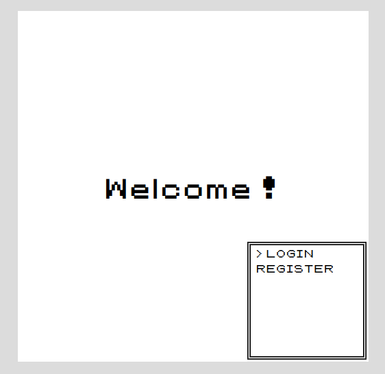

# PokeRetro

**WARNING**: This project is not ready for production, no security rules were implemented.

## Table of contents

1. [What is this repo ?](#what-is-this-repo-)
2. [Authors](#authors)
3. [Technologies used](#technologies-used)
4. [How to start](#how-to-start)
5. [How to play](#how-to-play)
6. [Micro-Services Map](#micro-services-map)
7. [Critical Transactions](#critical-transactions)
8. [License](#license)

## What is this repo ?

This repository is the final project we made in our engineering school of IMT Mines Alès.  
It was directed by M. Morgan FAGET in his course of "Architecture Logicielle - Microservices".

The aim is to create a Pokemon game with a micro-service software architecture.



Some features were required :
- Players can own 6 Pokemons in their team.
- Players doesn't need to capture Pokemon, there is a shop where they can buy eggs.
- Players can sell eggs.
- Eggs can be placed in an incubator. After a delay, they will hatch.
- Hatched Pokemon needs to be predefined before hatching but Pokemon stats have to be generated after hatching.
- If a player already own 6 Pokemon when an egg hatch, he needs to swap with a teammate.

Some additionnals features were partially implemented :
- Players can fight Pokemon
- Players can fight Bosses

## Authors

One of the project requirements was to get a team of 3 people :
- CASTEL Jérémy
- DARDAILLON Enzo
- DELFINO Clément

## Technologies used

The game is developped in Java with the SpringBoot framework for the backend and ReactJs for the frontend.

It also uses other techologies:
- Databases :
  - NoSQL --> MongoDB
  - SQL --> PostgreSQL
- Queue --> RabbitMQ
- RestAPI --> Spring
- Build Manager --> Maven
- Application Deployment --> Docker

## How to start

### Requirements

This project uses docker and docker-compose. Both of them must be installed.

### Installations

Download the images we built for you and load them into your docker with the following command:

```bash
docker image load < auth_app.tar
docker image load < frontend_frontend-app.tar
docker image load < incubator_incubator-app.tar
docker image load < inventory_inventory-app.tar
docker image load < pokemon_pokemon-app.tar
docker image load < shop_shop-app.tar
docker image load < team_team-app.tar
docker image load < trainer_app.tar
```

### Linux

Give the correct permissions to the script and start it.

```bash
chmod u+x start.sh
chmod u+x stop.sh

./start.sh
```

To stop it simply use the `stop.sh` script:

```bash
./stop.sh
```

## Micro-Services Map

Simple dependency map showing which micro-services must be powered on first as well as their application ports.

```
8080: auth
8081: trainer
       ├ pokemon
       └ team
8082: inventory
8083: shop
       ├ pokemon
       └ inventory
8084: incubator
       ├ pokemon
       ├ inventory
       └ team
8085: pokemon
8086: team
```

## Critical Transactions

A list of the critical transactions transactions some Micro-Services handle. This explains the Micro-Services dependency map.

## BaseShop: refresh

- Get list of eggables from pokemon

### BaseShop: sell

- Remove egg from inventory
- Deposit money to inventory

### BaseShop: buy

- Withdraw money from inventory
- Send egg to inventory

### Trainer: create

- Generate starter from pokemon
- Send starter to team (Rabbit)

### Incubator: place

- Remove egg from inventory

### Incubator: hatch

- Generate pokemon from pokemon
- Send pokemon to team (Rabbit)

## License

DBAD Public License

[LICENSE.MD](https://github.com/CastelJeremy/pokeretro/blob/main/LICENSE.md)
